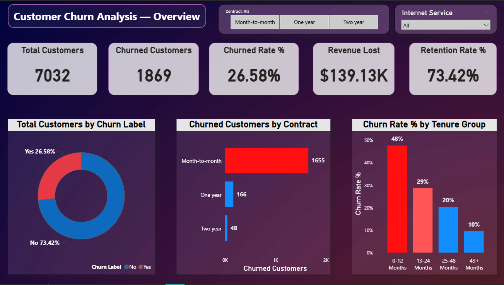
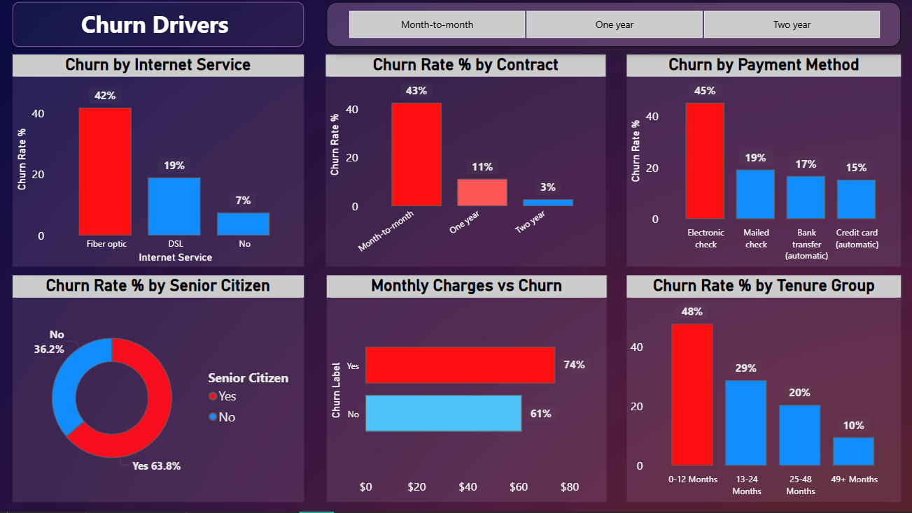
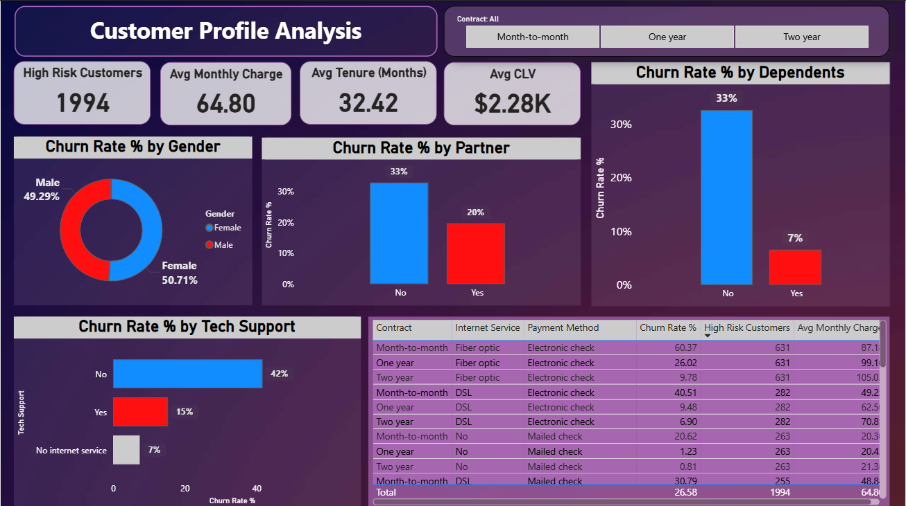

# 📊 Customer Churn Analysis & Retention Strategy
### Telecom Customer Data | Python • Power BI • SQL • Excel



**Dataset:** 7,032 telecom customers | 33 features
**Tools:** Python | Power BI | SQL | Excel
**Status:** ✅ Completed

---

## 📌 Problem Statement

Customer churn is a critical challenge in the telecom industry, directly impacting revenue and long-term profitability. Retaining existing customers is significantly more cost-effective than acquiring new ones, making churn reduction a key business priority.

This project analyzes customer data to identify the key factors driving churn and uncover actionable insights that help improve customer retention and reduce revenue loss.

---

## 🎯 Project Objective

Analyze telecom customer data to identify patterns and factors contributing to customer churn, and build an interactive Power BI dashboard to provide data-driven insights that help businesses improve retention strategies.

---

## 🔄 Project Workflow

1. **Data Cleaning & Preprocessing** — handled missing values, corrected data types, removed irrelevant columns
2. **Exploratory Data Analysis (EDA)** — identified patterns and trends across 30+ variables
3. **Feature Engineering** — created Tenure Groups and Churn Risk categories
4. **Data Visualization** — built 3-page interactive Power BI dashboard with 15+ DAX measures
5. **Business Insights & Recommendations** — delivered actionable retention strategies

---

## 🛠️ Technical Skills Used

| Skill | Usage |
|-------|-------|
| Python (Pandas, NumPy) | Data cleaning, preprocessing, and EDA |
| Power BI & DAX | Interactive dashboard, 15+ KPI measures |
| SQL | Data querying, aggregation, key insight extraction |
| Excel | Data validation and initial exploration |

---

## 📊 Key Metrics Tracked

- **Churn Rate** — percentage of customers who left
- **Revenue Lost** — monthly revenue impact of churn
- **Customer Lifetime Value (CLV)** — average total revenue per customer
- **Monthly Charges** — pricing impact on churn behavior
- **Contract Type Distribution** — risk level by contract type
- **Tenure Group Analysis** — churn risk by customer age

---

## 📈 Key Insights

| Insight | Finding | Business Impact |
|---------|---------|----------------|
| Overall Churn Rate | **26.58%** — 1,869 out of 7,032 customers | $139,130/month revenue lost |
| Contract Type | Month-to-month churn at **43%** | Highest risk contract type |
| Internet Service | Fiber optic customers churn at **42%** | Service/pricing issue |
| Payment Method | Electronic check users churn at **45%** | Highest risk payment method |
| Tenure | First 12 months churn at **48%** | Critical retention window |
| Senior Citizens | Churn at **63.8%** — 2.4x the average | Dedicated program needed |
| Tech Support | Without support: **42%** vs with support: **15%** | Bundle opportunity |
| Highest Risk Segment | Month-to-month + Fiber optic + Electronic check | **60.37% churn rate** |

---

## 📊 Dashboard Preview

### Page 1 — Overview KPIs


### Page 2 — Churn Drivers


### Page 3 — Customer Profile


---

## 💡 Business Recommendations

1. **Promote long-term contracts** — offer discounts to convert month-to-month customers to annual/two-year plans
2. **Focus on first 12 months** — implement strong onboarding and early engagement program to reduce 48% early churn
3. **Fix Fiber Optic service** — investigate pricing and service quality issues driving 42% churn in this segment
4. **Bundle Tech Support & Online Security** — customers with tech support churn 3x less (15% vs 42%)
5. **Senior citizen retention program** — dedicated simplified plans and support for 63.8% churn segment
6. **Incentivize automatic payments** — electronic check users churn at nearly 3x the rate of automatic payment users

---

## 📁 Project Structure

```
📦 Customer-Churn-Analysis
 ┣ 📂 data
 ┃ ┣ 📄 Telco_customer_churn.xlsx        ← Raw dataset (7,043 rows, 33 columns)
 ┃ ┗ 📄 telecom_churn_cleaned.csv        ← Cleaned dataset after preprocessing
 ┣ 📂 notebook
 ┃ ┗ 📓 Churn_Analysis.ipynb             ← Data cleaning & EDA
 ┣ 📂 dashboard
 ┃ ┣ 🖼️ dashboard_overview.png           ← Power BI Page 1 — Overview KPIs
 ┃ ┣ 🖼️ dashboard_churn_drivers.png      ← Power BI Page 2 — Churn Drivers
 ┃ ┗ 🖼️ dashboard_customer_profile.png  ← Power BI Page 3 — Customer Profile
 ┗ 📄 README.md
```

---

## 📌 Conclusion

This project demonstrates how data-driven analysis can uncover critical factors influencing customer churn. By leveraging Python for data processing and Power BI for visualization, the analysis identified that **month-to-month contracts, fiber optic service, and electronic check payments** form the highest-risk customer segment with a 60.37% churn rate.

Businesses that implement the recommended retention strategies — particularly targeting the first 12 months of customer tenure — can significantly reduce churn, improve customer satisfaction, and recover a substantial portion of the $139,130 monthly revenue currently being lost.

---

## 👤 Author

**Gopal Kumar** — Data Analyst
📍 Hyderabad, India

[](https://www.linkedin.com/in/gopal-kumar1/)
[](https://github.com/TheGopalN)
